# Presentation

Our team has just joined the software publisher ProSoft. Under the responsibility of the CIO, you will be in charge of managing the "EasySave" project which consists in developing a backup software.

## Version 1.1
### Flowchart:

### Sequence diagram 
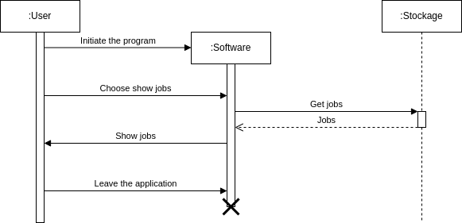
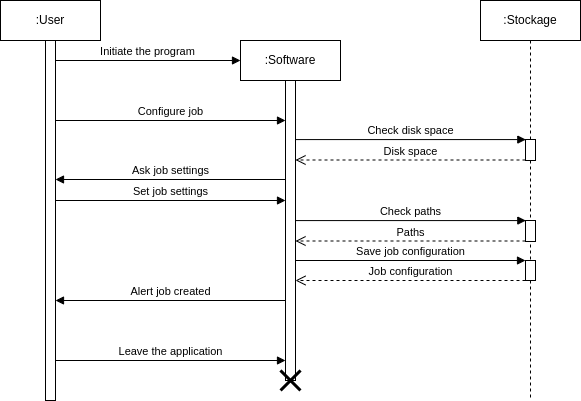
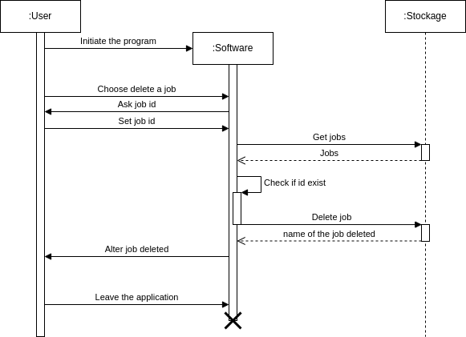
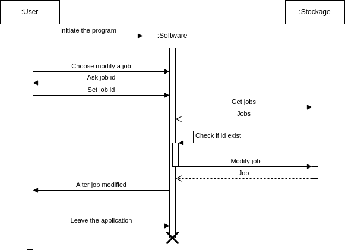
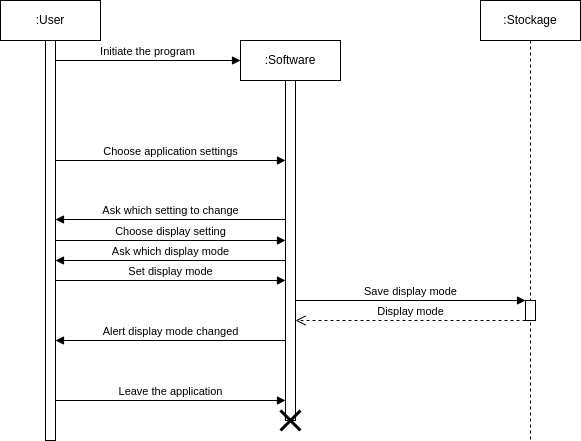

### Activity diagram
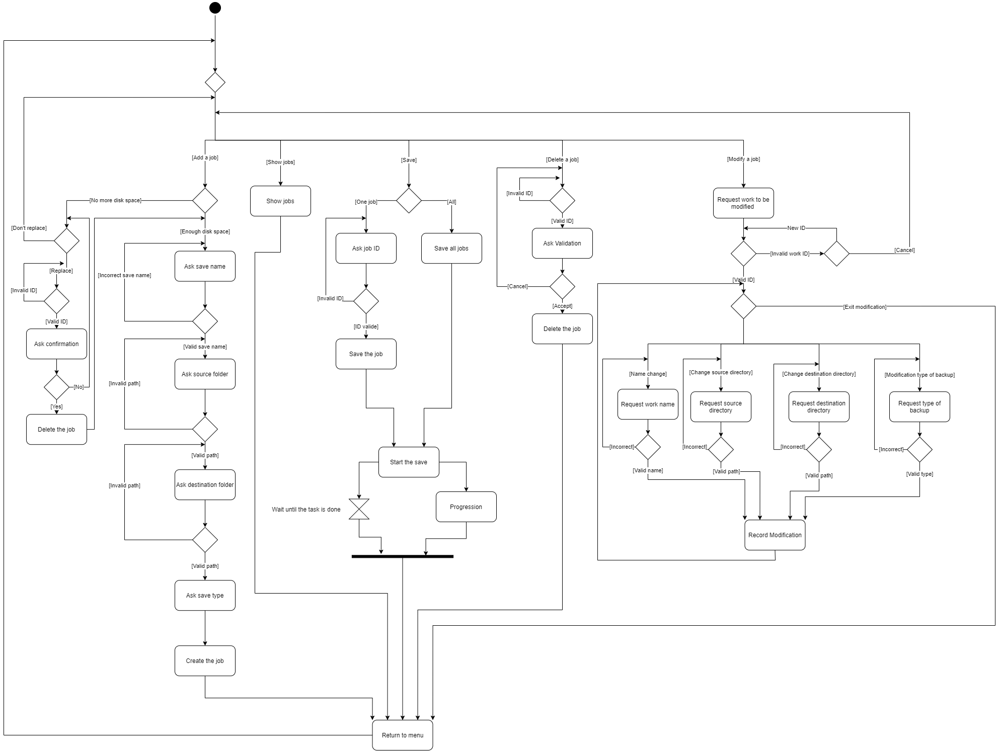
### Use case
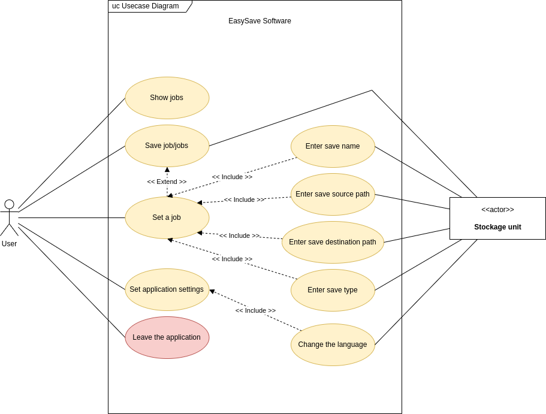
### Class diagram
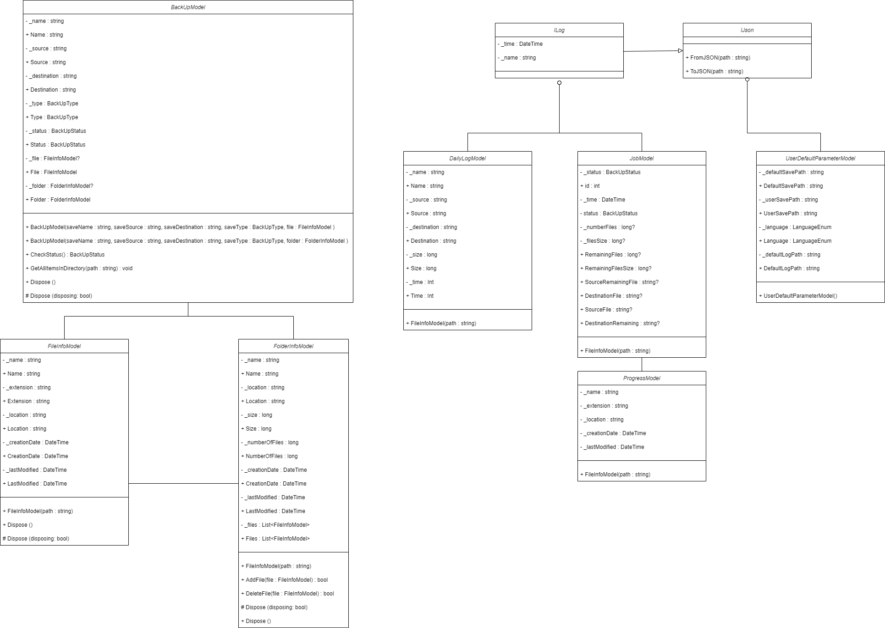
**How to install the application ?**

To install the application, you simply need to clone the repository. All files will be plugged in normally, then you just have to launch the executable file.

**LATEST RELEASE**

 - Ability to backup folders and files
 - Ability to change application settings
 - Ability to create and view a backup job
 - Log files in JSON

**UPCOMING FEATURES**

 - Graphics application
 - Log files in XML
 - Unlimited number of backup jobs
 - Backup encryption
 - Evolution of log files
 - Business software

User documentation is available to understand how the application works, especially to guide you to the main menu. It has been made so that the application is as UserFriendly as possible.

## Version 2.0
### Flowchart:

### Sequence diagram:

### Activity diagram:

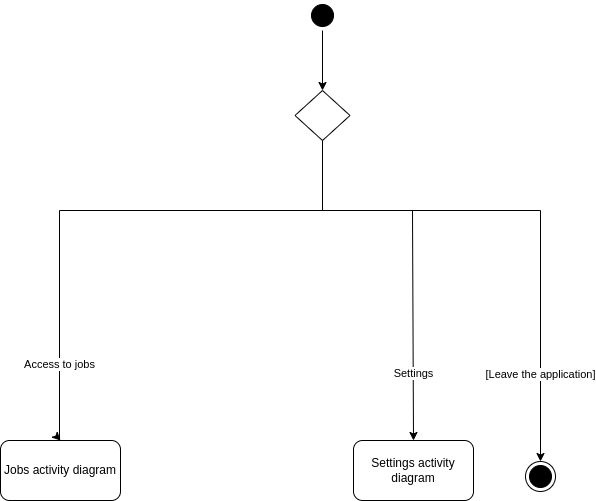

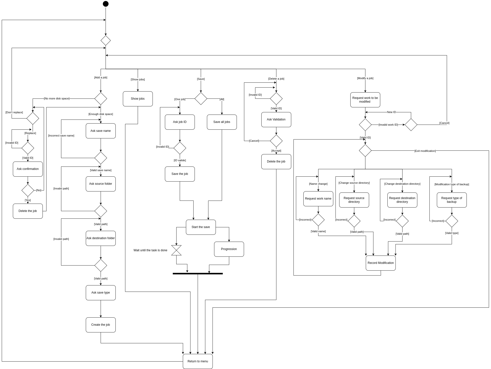

### Usecase diagram:

### Class diagram:

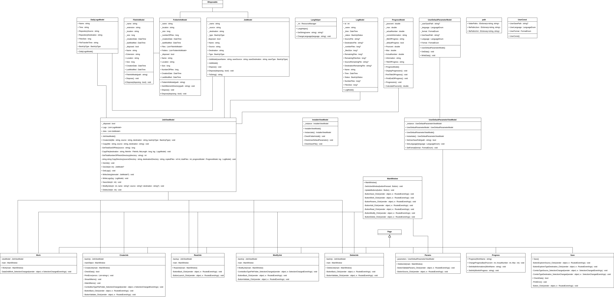

**How to install the application ?**

To install the application, you simply need to clone the repository. All files will be plugged in normally, then you just have to launch the executable file.

**LATEST RELEASE**

 - Graphical application
 - Log files in XML
 - Unlimited number of backup jobs
 - Backup encryption

**UPCOMING FEATURES**

 - Thread synchronisation
 - Progress bar

User documentation is available to understand how the application works, especially to guide you to the main menu. It has been made so that the application is as UserFriendly as possible.

